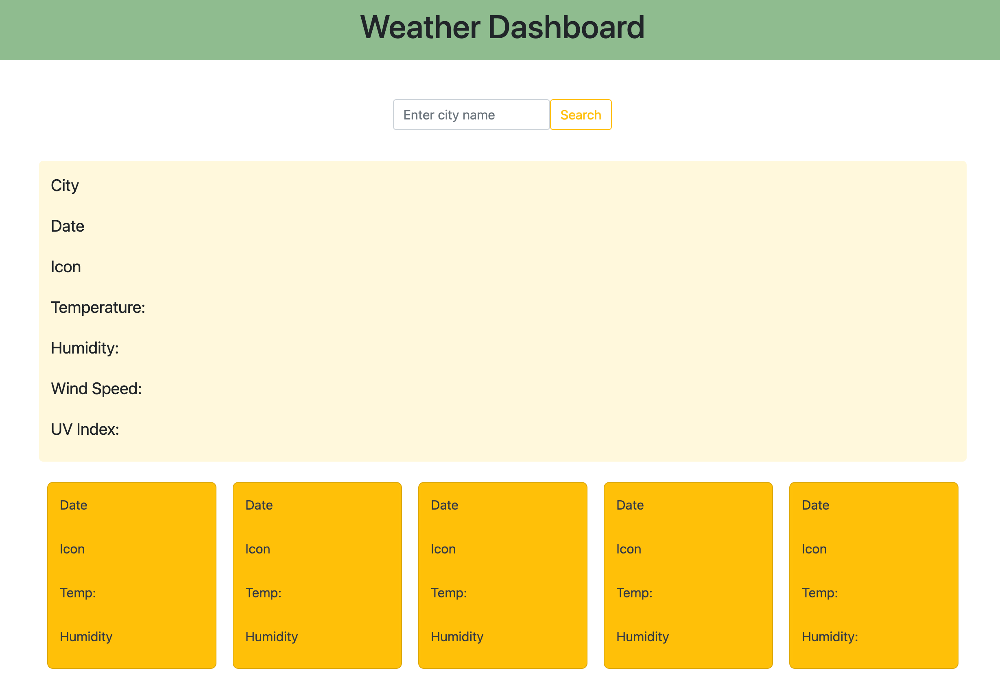

# Weather Dashboard
This application allows the user to find the current and five day forecast weather for any city. Once a city is searched, the value is stored on the page to remind the user of which cities she has searched for before. The city log is limited to five entries to avoid breaking the page layout with unlimited logs

## Technology

The website was built using HTML, CSS and Javascript, Bootsrap and JQuery.

## Pages

Single responsive page containing the interactive Dashboard.

## Contributing

Pull requests are welcome, but should be limited to improving the layout and styles. No special software is required to clone and run the website other than a basic code editor and a browser of choice. 

## License

MIT
